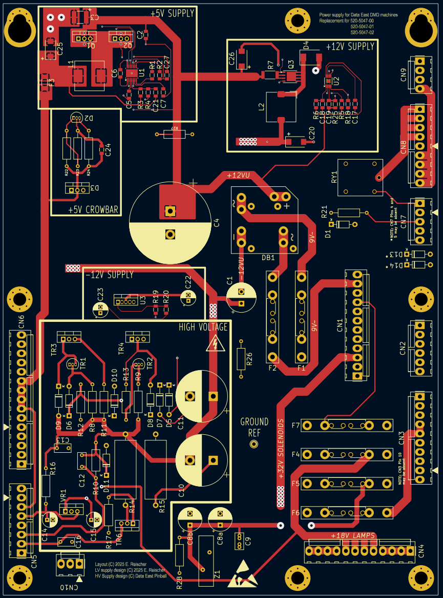

# Data_East_PS
Data East pinball power supply board, replacement for 520-5047-02

## Rationale

A short while ago, I became frustrated with the replacement power supply options available for Data East pinball machines. The factory original ones had several key deficiencies as I saw them:
 - Manufacturing of the PCB was rather poor, with many traces delaminating easily from the substrate
 - There was no overvoltage protection on the 5V logic supply (the main CPU board is rather expensive to replace, and is powered exclusively by this board)
 - 5V supply is incredibly inefficient, requiring a massive heatsink on the switching transistor to keep it healthy
 - Bridge rectifier is hard-soldered to the board, making replacement difficult (this part is known to fail)
 - 12V rails are unregulated; although this appears to be an explicit design choice by the OEM, it results in an audible 50/60Hz hum from the audio system
 - General illumination relay is noisy and prone to contact wear
 - Glass fuses are difficult to change, and the connectors are prone to failure

Additionally, I didn't like many aftermarket supplies:
 - Rottendog is stable, but significantly under-caps the -12V rail for unknown reasons; this makes the audio system hum 50x worse
 - Most have 0.093" connectors are soldered to the board; these are stiff pin & socket connectors and you really stress the substrate when plugging/unplugging them
 - XPin doesn't appear to separate their rails (they say issues on 12V rails can propagate back to the 5V bus); I can't tell for sure because they don't publish the schematic for their board (as is their right not to)
 - Cost; most aftermarket replacements are over $150, but a BOM for one of these is usually less than $20, plus the cost of the PCB

So, I set out to build my own, open-source, higher-efficiency version. Since many older machines are transitioning to LED displays, the high-voltage section is a part-for-part copy from the original schematic (I'm using TFTC's schematics, as they're the highest resolution I could find on IPDB). The 5V, +/-12V, and GI control sections are redesigns for efficiency, simplicity, or serviceability, and will be adding crowbar circuits to each for protection from HV display faults.  Once complete, I will post Gerbers and a BOM shopping cart to do a complete build. Using kicad version 8.0.8.

## Specifications

Gathering all my research into this section.

+5V output on the stock supply is limited to 5.5A.  This was ascertained from the MC1723 datasheet, which specifies the limiting current via the Rsense (R6) resistor value, which is 0.12 ohms in the -02 version. The equation is: Isc = 0.66 / Rsense

Power limits of the HV section isn't as clear from the components (all are well oversized), but is limited to a combined ~45W between the 90 and 100V legs of the input transformer, due to fuse F7. Also, the voltage tolerances on this section aren't as stringent as the delta-V between them, since they aren't driving logic, but a VFD. As long as the high end of the voltages don't exceed the HV shift registers, any damage done will be long-term damage to the vacuum display itself.

The +/- 12V rails are going to be regulated; the -12V is only used in the sound board, and even there it's further regulated to -5V for op-amps.  The +12V rail is used for sound (which should be cleaner than it is from factory), and some accessories that vary by game (e.g., motors, widgets, etc.).  As it sits from the factory, these rails can have as much as 1-2V of ripple, which is bad for the sound board.  However, if you examine the sound card schematic, the only place the +12V is used is to power the MB3730 drivers, but since these are advertised to support 8-16V of supply, we can drive this with ~10V of clean power rather than 12V of noisy power.  So to keep things simple, we'll split the +12V rail up into two supplies: one with active regulation that drives CN6, and one that's just rectified and filtered that'll go everywhere else.  Using round numbers, assume the regulated +12V will need on the order of 50W of power.  The -12V rail will be active regulated, but the 7905 on the sound board only needs -7V or greater(?), so we'll make this rail actually -10V to simplify the regulator design to just buck rather than buck-boost.

Glass fuses will be replaced with blade-style automotive fuses, which are both cheaper and easier to change.  An added bonus is that the connectors for those is more robust too.  Will leave F7 for the HV section as the glass fuse though since blade fuses aren't rated for that voltage.

### Transformer Analysis

*Note: all of this was analyzed using the 10-5003-00 in my Jurassic Park system.*

Power limits of the transformer: Unfortunately, these are undocumented from what I've been able to find. However, we can infer *minimum* limits from the factory fusing specifications on the various systems that utilized it:

#### Primary Windings

| Pair Colors | Inductance | Q-Factor | Resistance | Tap Ratio (Re: Black/Brown) |
|-------------|------------|----------|------------|-----------------------------|
| Black / Brown | 15.107 mH | 11.00 | 8.628 &Omega; | -- |
| Black / Orange | 18.673 mH | 10.57 | 11.079 &Omega; |  |
| White-Black / White-Brown | 15.159 mH | 10.75 | 8.840 &Omega; | 1:1 |
| White-Black / White-Orange | 18.636 mH | 10.64 | 11.025 &Omega; |  |

#### Secondary Windings

| Pair Colors | Inductance | Tap Ratio (Re: Black/Brown) | Q-Factor |Resistance | Voltage (AC) | Power Delivery (min) | Usage |
|-------------|------------|-----------------------------|----------|-----------|---------|--------------------|-------|
| Yellow-White / Yellow | 55.7 &mu;H | 16.59:1 | 5.6 | 0.060 &Omega; | 6V | 120W | General Illumination |
| Grey-White / Grey | 138.9 &mu;H | 10.42:1 | 8.42 | 0.103 &Omega; | 9V | 63W | Logic, Sound & Motors |
| Grey-White / Grey-Green | 139.3 &mu;H | 10.42:1 | 8.79 | 0.099 &Omega; | 9V | 63W | Logic, Sound & Motors |
| Grey-Green / Grey | 558.3 &mu;H |  | 11.78 | 0.299 &Omega; | | | |
| Blue-White | 277.9 &mu;H | 7.60:1 | 9.02 | 0.194 &Omega; | 13V | 104W | Lamps |
| White-Red | 1148.2 &mu;H | 3.60:1 | 12.05 | 0.595 &Omega; | 25V | 200W | Solenoids |
| Black-Yellow | 3.908 mH | 1.97:1 | 11.89 | 2.074 &Omega; | 48V | 240W | Solenoids |
| White-Green / White | 11.664 mH |  | 8.07 | 9.035 &Omega; | 90V | ? <45W | VFD |
| Black-Red / White | 17.855 mH | 0.888:1 | 8.40 | 13.361 &Omega; | 100V | ? <45W | VFD |

*Note all measurements were at 1 Khz*

*The 9VAC outputs are a bit of an anomaly - they are wired as a center-tapped pair of 9VAC RMS each. The primary purpose of these taps are to drive the +5V logic and +/- 12V sound/accessory rails. On power supply revisions 02 and up, CN7 outputs a half-wave rectified version of each of the 9VAC taps to pins 4 and 5 as a weak (and noisy) -12VDC rail. It does not appear to be used on any of the 6 games that shipped with this supply revision.

For a "115V" input (i.e. 110-120V), both primary sides of the transformer are wired in parallel.  The "center" taps for each primary appear to be at about 80%, which (when used) will give a small output voltage boost for primary voltages lower than the standard 115/230V. For a 230V primary, the primaries are wired in series.

On my Jurassic Park machine, the "9V" taps measured 10.63V for a 122.3V primary.

*Source for most of my analysis: Jurassic Park & Tales From The Crypt Schematics*
